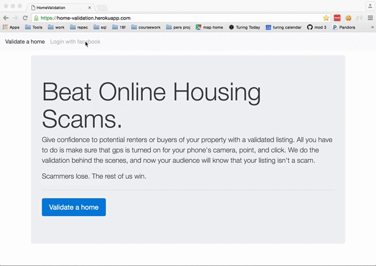

## Home Validation

### Purpose

While searching for rental units in Denver in early 2016, I found several promising listings on craigslist. However, after contacting the owners of those listings, I realized that I was being pulled into some kind of scam.

Eventually I realized that one way to detect these scam listings was by their slightly-too-nice photos attached to the listings.

This app builds on my intuition. By using the googls maps api and the EXIFR gem, a person listing their unit for rent can upload a photo my site (live at home-validation.herokuapp.com) along with the address of the unit. If that photo has gps metadata and was taken close to their unit, the app will validate the listing. The person can then link to the validation in order to authenticate their listing on other sites.

### Demo

### Setup Instructions
1. clone down the repo
2. bundle
3. rake db:create db:migrate
4. The application uses the figaro gem to hide keys for various services, including AWS. As a result, to use the app in development or production requires either setting up an AWS account or changing the configuration options in config/environments.
